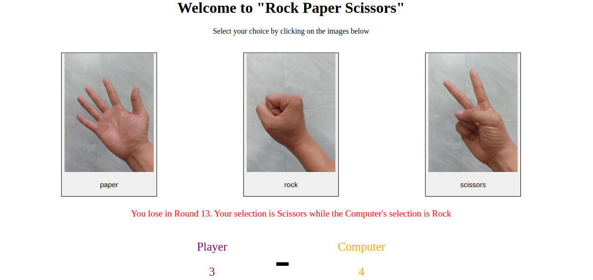
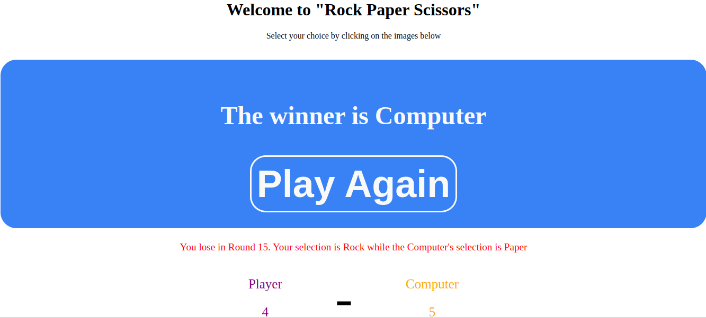

# odin_rock_paper_scissors

[Task Description 1](https://www.theodinproject.com/lessons/foundations-rock-paper-scissors)
[Task Description 2](https://www.theodinproject.com/lessons/foundations-revisiting-rock-paper-scissors)

[Live Preview](https://maxim55069633.github.io/3.odin_rock_paper_scissors/)

Classic game "rock paper scissors". Display the running score, and announce a winner of the game once one player reaches 5 points.

In this project, I practice the basic javascript skills including: function, DOM manipulation, and Events.

Screenshot:

1. 

2. 
